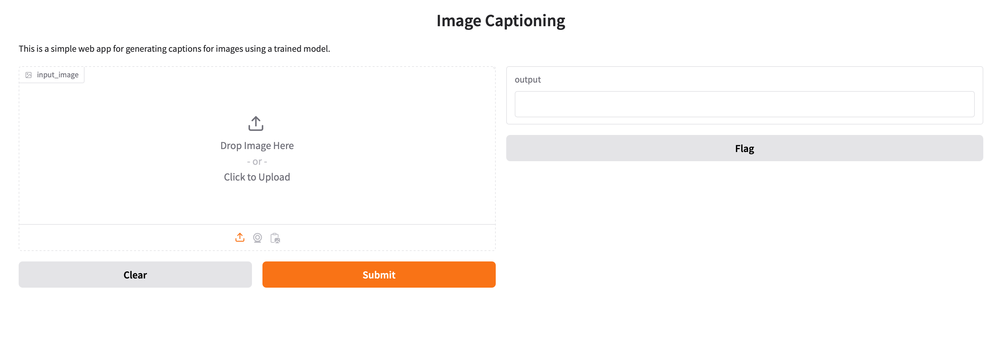
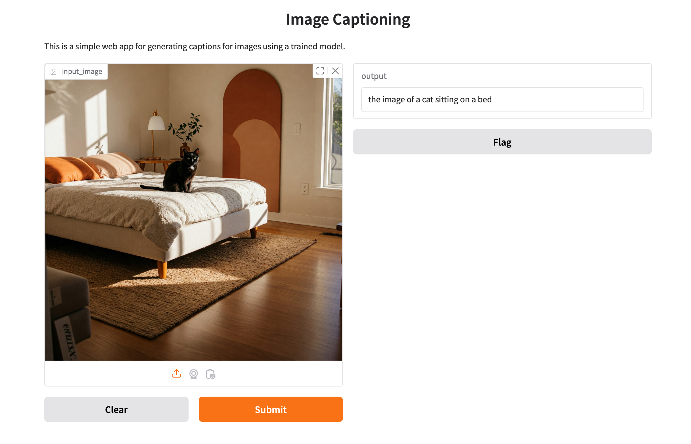

# Generative AI Course Tasks

use Python 3.11.9 (or 3.10.14)

Create a .venv and point it to a Python 3.11.9 installation

```bash
pip install langchain==0.1.11 gradio==5.23.2 transformers==4.38.2 bs4==0.0.2 requests==2.31.0 torch==2.2.1
```

# Image captioning app
```bash
cd image_captioning
python3 image_captioning_app.py
```

image_captioning_app.py
This app takes an image as input and generates a caption for it using a pre-trained image captioning model (BLIP). The interface is made with Gradio.




# Url captioner

Takes the url of a webpage and generate a list of image urls or local paths with captions.
```bash
cd url_captioner
python3 automate_url_captioner.py
python3 local_captioner.py
```